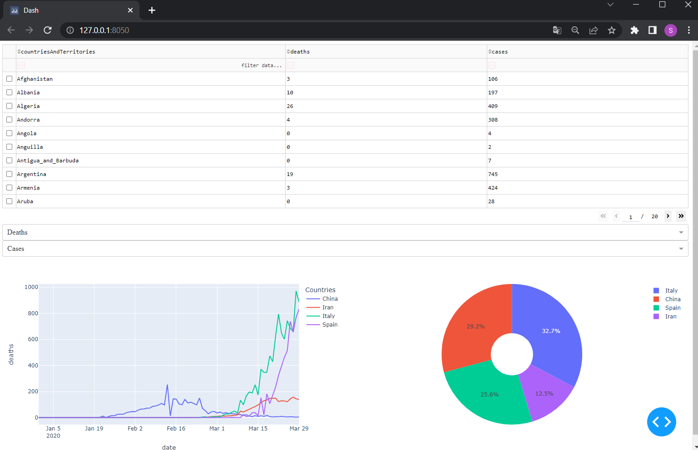

# CovidTracker
Covid Tracker dashboard


__Simple covid tracking Dash Board using python__

## Modules used are:-
```
import pandas as pd     #(version 1.0.0)
import plotly           #(version 4.5.4) pip install plotly==4.5.4
import plotly.express as px

import dash             #(version 1.9.1) pip install dash==1.9.1
import dash_table
import dash_core_components as dcc
import dash_html_components as html
from dash.dependencies import Input, Output
```

DATA SET USED:-

Taken from https://www.ecdc.europa.eu/en/geographical-distribution-2019-ncov-cases

--------------------------------------------------------------

# Instructions to run:-

Run simply from the IDE and open the local server host or the link apeared in the terminal similar to 

👇👇.
```
Dash is running on http://127.0.0.1:8050/
```

You see the output as :- 



There is an optimised search bar feel free to explore and how the chart and bar graphs behave according to it.

### Hope You Like The Project 😊😊😊.

## Made with ❤️❤️❤️❤️.

---------------------------------------------------

# Peace to everyone 🙏🙏🙏
